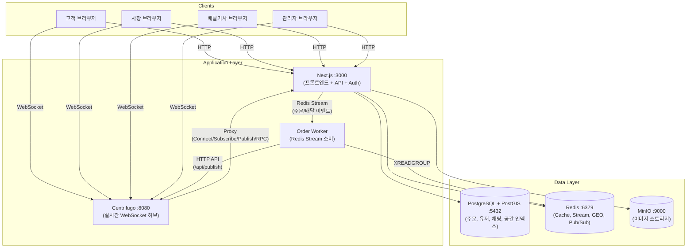
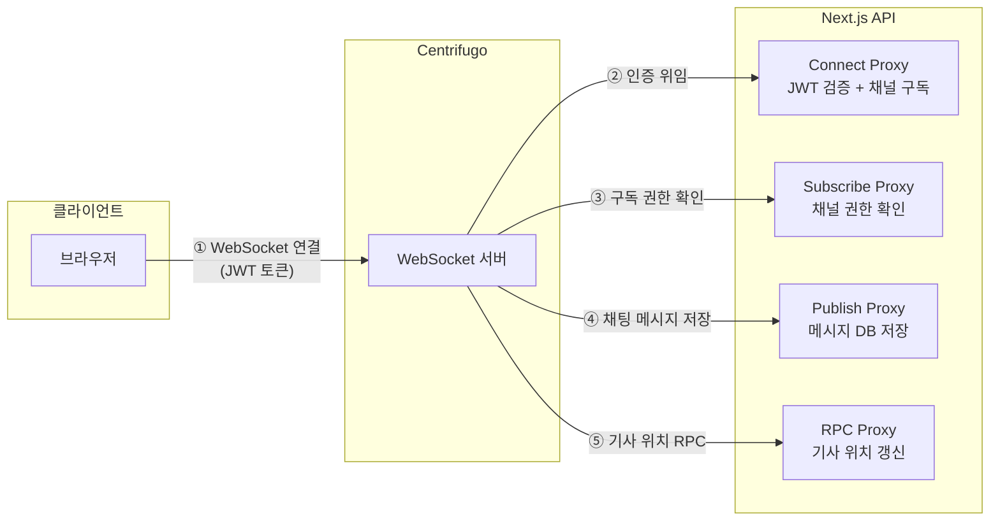
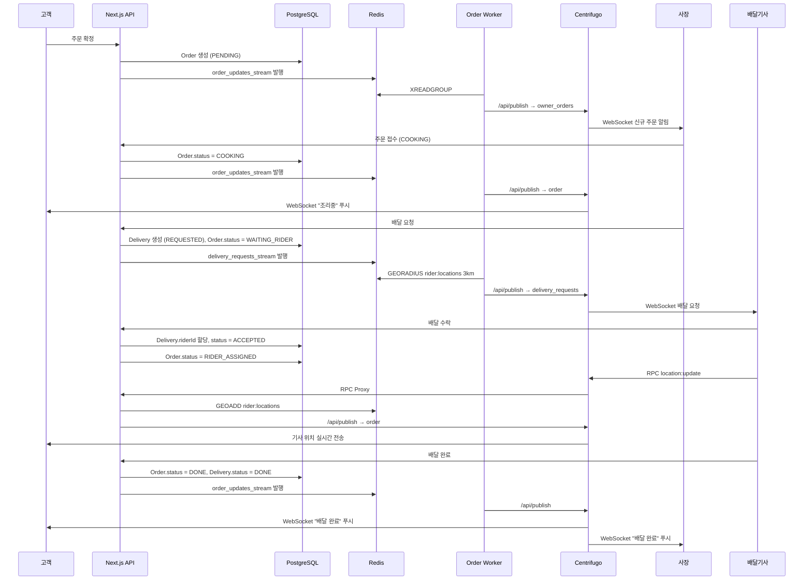
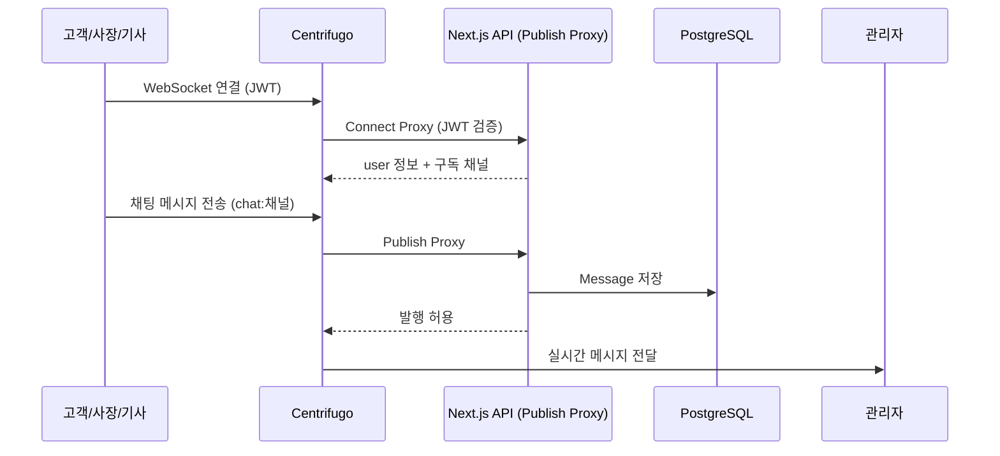
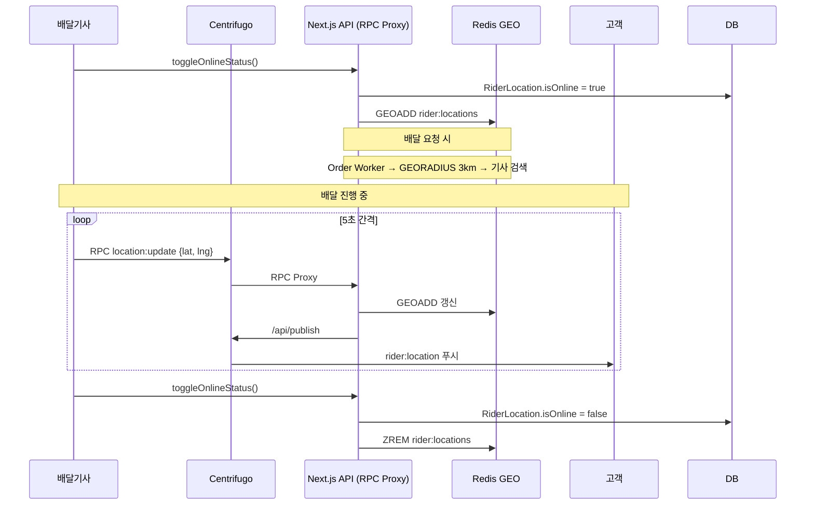
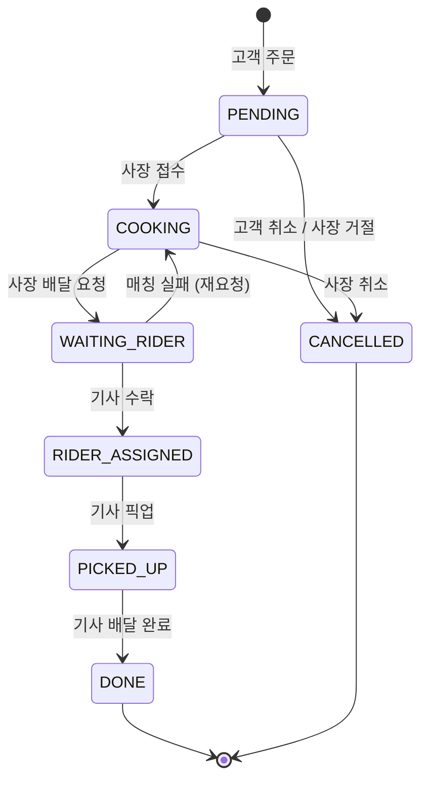

# B-Delivery 시스템 아키텍처 (v3)

## 서비스 구성도

## 실시간 통신 구조 (Centrifugo Proxy 패턴)

## 주문 + 배달 전체 플로우

## 채팅 메시지 흐름

## 배달기사 위치 추적

## Docker 서비스 구성

| 서비스 | 이미지 | 포트 | 역할 |
|--------|--------|------|------|
| postgres | postgres:15-alpine + PostGIS | 5432 | 메인 DB (공간 인덱스) |
| redis | redis:7-alpine | 6379 | Cache, Stream, GEO, Pub/Sub |
| centrifugo | centrifugo/centrifugo:v6 | 8080 | 실시간 WebSocket 허브 (Proxy 패턴) |
| order-worker | node:20 (tsx) | - | Redis Stream 소비 → Centrifugo 발행 |
| minio | minio/minio | 9000, 9001 | 이미지 스토리지 & 콘솔 |
| web-app | node:20 (Next.js) | 3000 | 프론트엔드 + 백엔드 API |

모든 컨테이너는 `bdelivery_net` 브리지 네트워크로 DNS 통신합니다.

## 주문 상태 흐름 (State Machine)

## Redis 역할 (4-in-1)

| 기능 | 용도 | 키/패턴 |
|------|------|---------|
| **Cache** | 음식점 목록 (5분 TTL), 메뉴 데이터 (10분 TTL) | `restaurant:*`, `menu:*` |
| **Stream** | 주문 상태 변경 이벤트 큐, 배달 요청 이벤트 큐 | `order_updates_stream`, `delivery_requests_stream` |
| **GEO** | 배달기사 실시간 위치 (GEOADD/GEORADIUS) | `rider:locations` |
| **Pub/Sub** | Centrifugo 수평 스케일링 시 노드 간 동기화 | - |

## 사용자 역할

| Role | 접근 가능 페이지 | 설명 |
|------|-----------------|------|
| USER | 홈, 음식점, 장바구니, 주문, 마이페이지, 채팅 | 일반 고객 |
| OWNER | 사장 대시보드 (주문관리, 메뉴관리, 배달요청, 매출통계) | 음식점 사장 |
| RIDER | 배달대기, 배달진행, 배달내역, 마이페이지 | 배달기사 |
| ADMIN | 관리자 대시보드 (KPI, 사용자관리, 고객센터 상담) | 플랫폼 관리자 |

## 캐싱 전략

| 대상 | 저장소 | TTL | 무효화 |
|------|--------|-----|--------|
| 음식점 목록 | Redis | 5분 | 등록/수정/삭제 시 |
| 메뉴 데이터 | Redis | 10분 | 수정/품절 시 |
| 배달기사 위치 | Redis GEO | 실시간 | 5초 갱신 |
| 사용자 세션 | JWT | - | 만료 시 |

## 스케일링 전략 (10만 유저)

| 구간 | 전략 |
|------|------|
| DB 읽기 부하 | Read Replica 분리 (홈 피드, 검색) |
| DB 커넥션 | PgBouncer 커넥션 풀링 |
| 반경 검색 | PostGIS 공간 인덱스 + Redis GEO |
| WebSocket | Centrifugo 수평 스케일링 (Redis Engine) |
| 비동기 처리 | Order Worker 다중 인스턴스 (Consumer Group) |
| 이미지 | MinIO + CDN |
| API 부하 | Next.js ISR (음식점 상세: revalidate 60s) |
| Rate Limiting | Redis 기반 (주문 분당 5회, 검색 분당 30회) |
