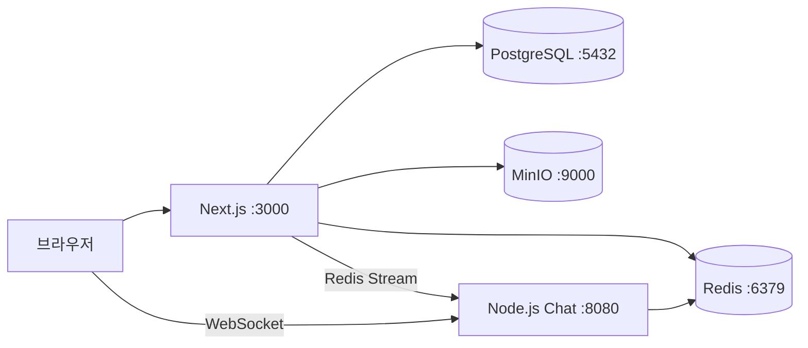
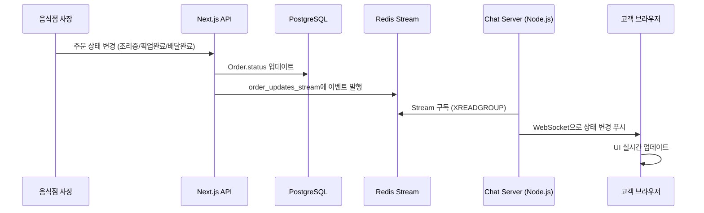
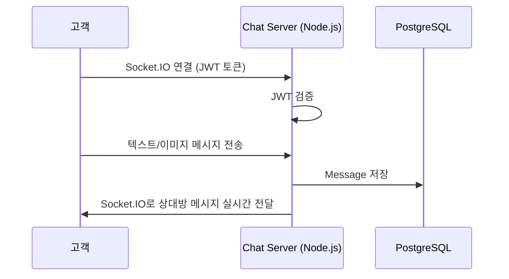

# B-Delivery 시스템 아키텍처

## 서비스 구성도



## 주문 상태 실시간 업데이트 흐름



## 채팅 메시지 흐름



## Docker 서비스 구성

| 서비스 | 이미지 | 내부 포트 | 외부 포트 | 역할 |
|--------|--------|-----------|-----------|------|
| postgres | postgres:15-alpine | 5432 | 5432 | 메인 데이터베이스 |
| redis | redis:7-alpine | 6379 | 6379 | 주문 상태 Stream |
| minio | minio/minio | 9000, 9001 | 9000, 9001 | 이미지 스토리지 & 콘솔 |
| chat-server | node:20 | 8080 | 8080 | Socket.IO 실시간 서버 (채팅 + 주문 상태 푸시) |
| web-app | node:20 | 3000 | 3000 | Next.js 웹 앱 |

모든 컨테이너는 `bdelivery_net` 브리지 네트워크로 DNS 통신합니다.

## 주문 상태 흐름

```
PENDING (주문 접수)
  → COOKING (조리중) — 사장이 변경
    → PICKED_UP (픽업 완료/배달 중) — 사장이 변경
      → DONE (배달 완료) — 사장이 변경
  → CANCELLED (취소)
```
