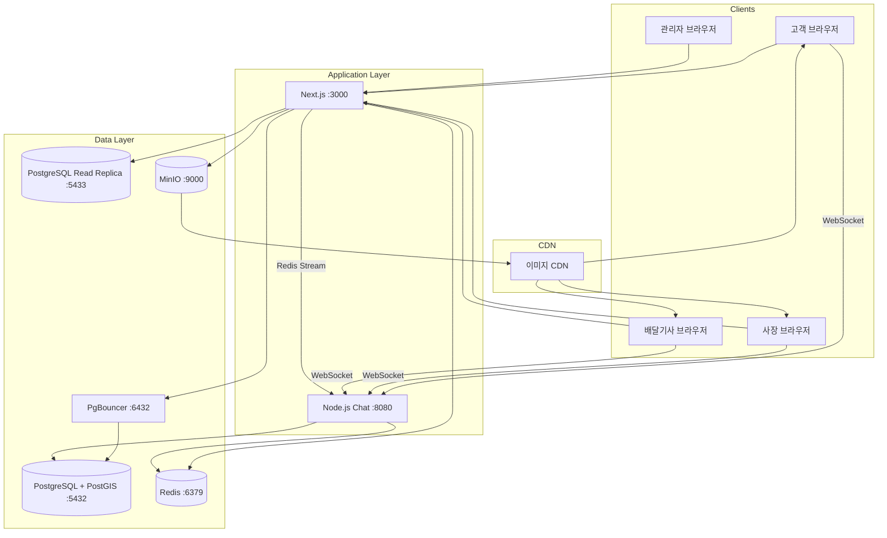
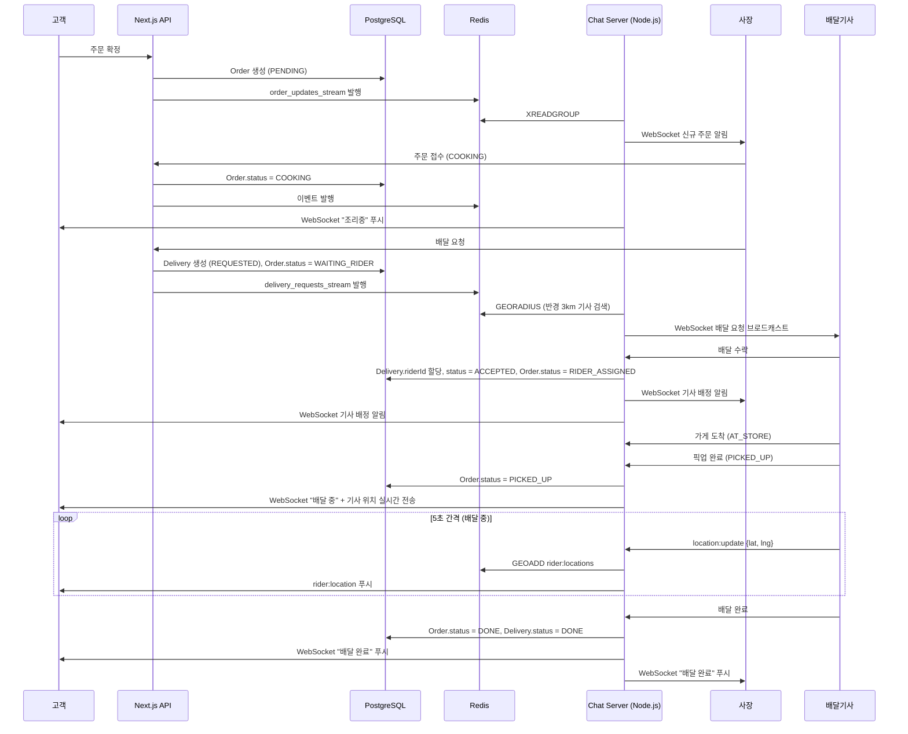
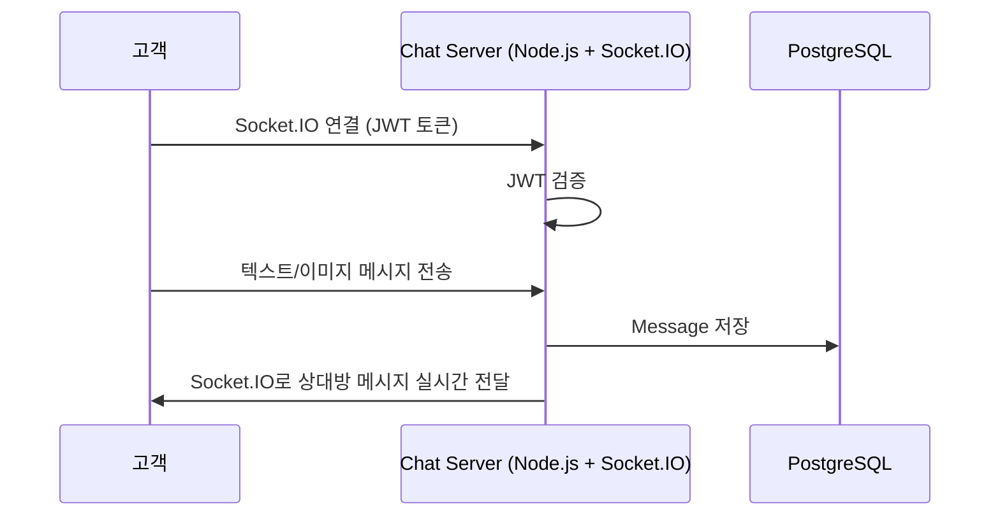
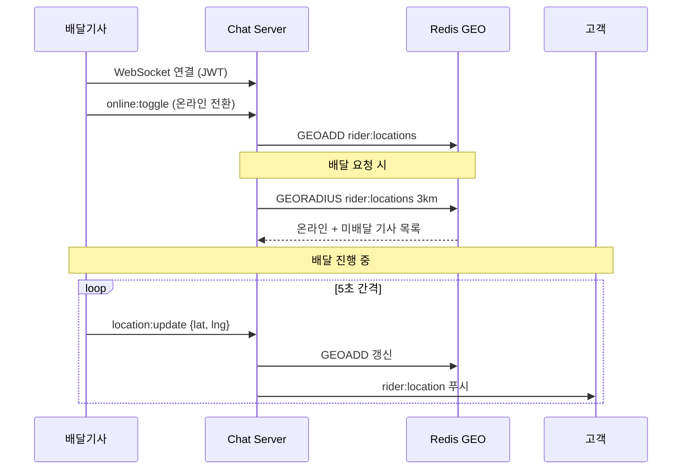
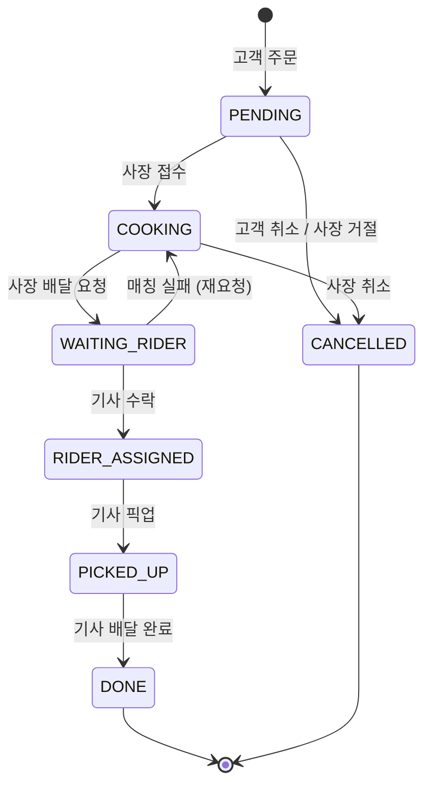

# B-Delivery 시스템 아키텍처 (v2)

## 서비스 구성도



## 주문 + 배달 전체 플로우



## 채팅 메시지 흐름



## 배달기사 위치 추적



## Docker 서비스 구성

| 서비스 | 이미지 | 내부 포트 | 외부 포트 | 역할 |
|--------|--------|-----------|-----------|------|
| postgres | postgres:15-alpine + PostGIS | 5432 | 5432 | 메인 DB (공간 인덱스) |
| postgres-read | postgres:15-alpine | 5432 | 5433 | 읽기 전용 레플리카 |
| pgbouncer | pgbouncer | 6432 | 6432 | 커넥션 풀링 |
| redis | redis:7-alpine | 6379 | 6379 | 캐시, Stream, GEO, Pub/Sub |
| minio | minio/minio | 9000, 9001 | 9000, 9001 | 이미지 스토리지 & 콘솔 |
| chat-server | node:20 | 8080 | 8080 | Socket.IO 실시간 서버 |
| web-app | node:20 (Next.js) | 3000 | 3000 | 메인 웹 애플리케이션 |

모든 컨테이너는 `bdelivery_net` 브리지 네트워크로 DNS 통신합니다.

## 주문 상태 흐름 (State Machine)



```
PENDING (주문 접수) — 고객/사장 취소 가능
  → COOKING (조리중) — 사장이 접수
    → WAITING_RIDER (기사 매칭 대기) — 사장이 배달 요청
      → RIDER_ASSIGNED (기사 배정) — 기사가 수락
        → PICKED_UP (픽업 완료/배달 중) — 기사가 픽업
          → DONE (배달 완료) — 기사가 완료
  → CANCELLED (취소) — 상태별 취소 규칙 적용
```

## 사용자 역할

| Role | 접근 가능 페이지 | 설명 |
|------|-----------------|------|
| USER | 홈, 음식점, 장바구니, 주문, 마이페이지, 채팅 | 일반 고객 |
| OWNER | USER + 사장 대시보드 (주문관리, 메뉴관리, 배달요청) | 음식점 사장 |
| RIDER | 배달대기, 배달진행, 배달내역, 마이페이지 | 배달기사 |
| ADMIN | USER + 관리자 대시보드 | 플랫폼 관리자 |

## 캐싱 전략

| 대상 | 저장소 | TTL | 무효화 |
|------|--------|-----|--------|
| 음식점 목록 | Redis | 5분 | 등록/수정/삭제 시 |
| 메뉴 데이터 | Redis | 10분 | 수정/품절 시 |
| 배달기사 위치 | Redis GEO | 실시간 | 5초 갱신 |
| 사용자 세션 | JWT | - | 만료 시 |

## 스케일링 전략 (10만 유저)

| 구간 | 전략 |
|------|------|
| DB 읽기 부하 | Read Replica 분리 (홈 피드, 검색) |
| DB 커넥션 | PgBouncer 커넥션 풀링 |
| 반경 검색 | PostGIS 공간 인덱스 |
| WebSocket | Socket.IO Redis Adapter → 수평 스케일링 |
| 이미지 | MinIO + CDN |
| API 부하 | Next.js ISR (음식점 상세: revalidate 60s) |
| Rate Limiting | Redis 기반 (주문 분당 5회, 검색 분당 30회) |
